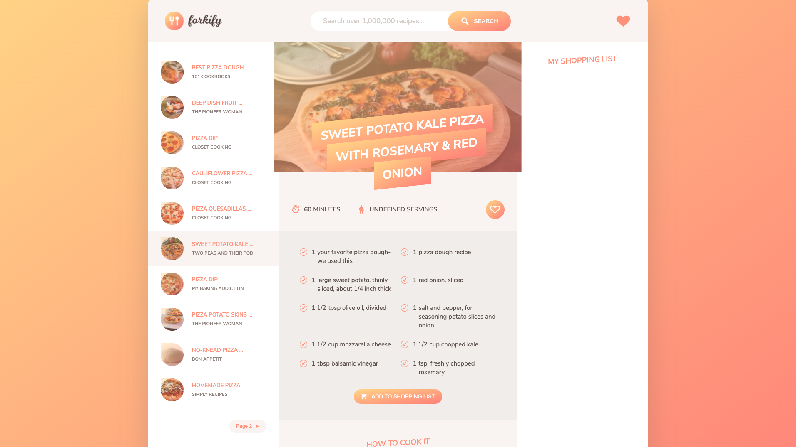

# budget-app
This is a recipe search web application

<br/>

## Screenshot
This is what it looks like



<br/>

## How to run the application


Clone the repo
```
git clone https://github.com/johnnysea/forkify-app.git
```
Execute the following code
```
npm install
npm run build
npm run start
```


<br/>

## How to run the application with Docker
These instructions will get you a Docker image of the application and running on Docker locally

Pull Docker image from Dockerhub
```
docker pull johnnysea/react-app-repo:forkify-app
```

Run Docker container
```
docker run -d --name forkify-app -p 8080:80 johnnysea/react-app-repo:forkify-app
```


Open http://localhost:8080 in a web browser

<br/>

## Built With
* [JavaScript](https://www.javascript.com/) 
* [Docker](https://www.docker.com/)

<br/>

## Authors

Johnny Shao
